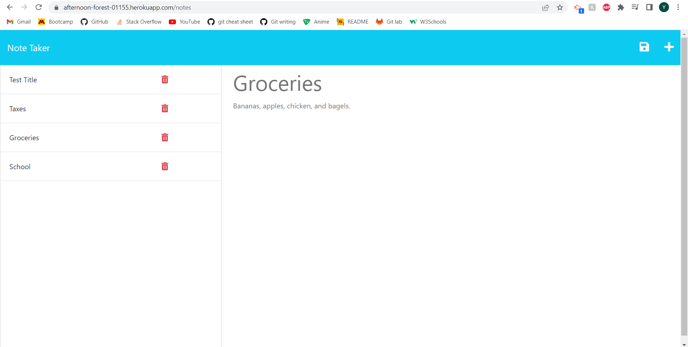

# Note Taker and Maker

## Description

This project was created in order to create, update, and delete notes and any other helpful information that could be stored. During this project, I learned how front-end and back-end applications interact with each other. It is very important both sides know how information is going to be passed between them. I plan on using this as a daily/weekly planner.

## Installation/Usage

The live application can be found at the link below along with a screenshot of the deployed application.

https://afternoon-forest-01155.herokuapp.com/notes

 

## Credits

I used the University of Minnesota Bootcamp week 11 student project for some helper code and a template for code layout.

## License

This repository uses an MIT license.